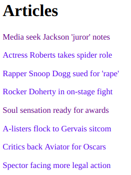
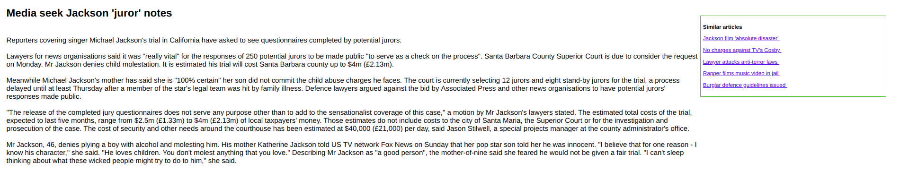

# Article Recommendation System

This project makes a simple article recommendation engine using a natural
language processing and word embeddings. The database comes from 
Stanford's GloVe project trained from Wikipedia articles. The project
will read in a database of word vectors and a corpus of text articles.

The data comes from [BBC]

# Tutorial

Make sure you download the GloVe file and BBC directory to run this code.

gunicorn -D --threads 4 -b 0.0.0.0:5000 --access-logfile server.log --timeout 60 server:app glove.6B.300d.txt bbc

# Output

